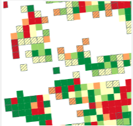
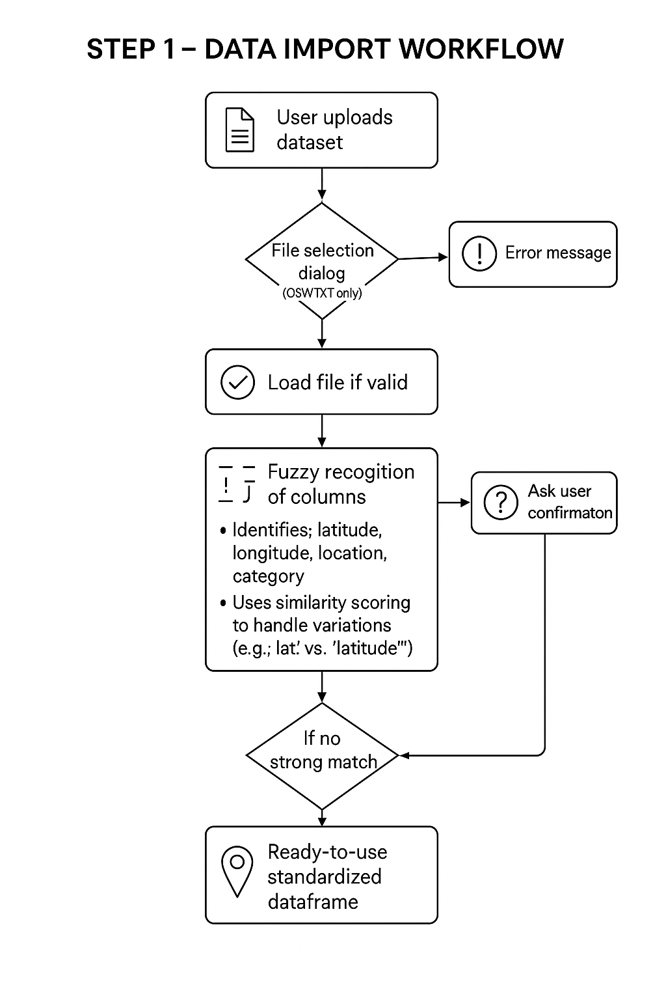
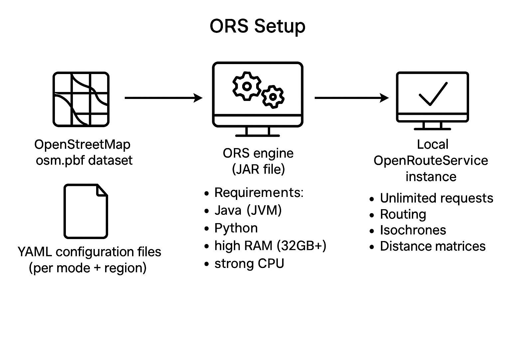

# Healthy Urban Planning : Accessibility and modes of access to various urban spaces
This project was conducted as part of the "Policy-in-Action" module of the École Polytechnique-ENSAE Master's program in "Data and Economics for Public Policy. It was done for ECOLAB at the Ministère de la transition écologique.

Students : Salma El Aazdoudi, Robert Campbell Powers, Mona Bennis and Sofia Vaca. 

Under the supervision of : Pierre Boyer (Ecole Polytechnique, CREST) & Franck Malherbet (ENSAE, CNRS)

# Table of Contents

- [Literature review on healthy urban planning](#literature-review-on-healthy-urban-planning)
- [Description of our objectives](#description-of-our-objectives)
- [Data description and exploration](#data-description-and-exploration)
  - [Amenities Data: Base Permanente des Équipements (BPE)](#amenities-data-base-permanente-des-équipements-bpe)
  - [INSEE Carreaux dataset](#isee-carreaux-dataset)
- [Methodology:](#methodology)
  - [Script that allows users to input their own data](#script-that-allows-users-to-input-their-own-data)
  - [Building isochrones](#building-isochrones)
    - [Configuration of OpenRouteService](#configuration-of-openrouteservice)
      - [Services configuration](#services-configuration)
      - [Engine configuration](#engine-configuration)
      - [Endpoints configuration](#endpoints-configuration)
      - [Logging configuration](#logging-configuration)
      - [Running OpenRouteService](#running-openrouteservice)
    - [Isochrone computation using OpenRouteService](#isochrone-computation-using-openrouteservice)
      - [Configuration and parameter setting](#configuration-and-parameter-setting)
      - [Loading and preparation of the “carreaux” spatial data](#loading-and-preparation-of-the-carreaux-spatial-data)
      - [Initialisation of the ORS client](#initialisation-of-the-ors-client)
      - [Iterative computation of isochrones](#iterative-computation-of-isochrones)
      - [Post-processing: converting JSONL to GeoDataFrame](#post-processing-converting-jsonl-to-geodataframe)
  - [Building accessibility scores](#building-accessibility-scores)
  - [Breaking France into regions](#breaking-france-into-regions)
  - [E. Visualizing the data](#e-visualizing-the-data)
    - [Building the web application](#building-the-web-application)
    - [Data Handling Strategy](#data-handling-strategy)
    - [Clustering and Visualization](#clustering-and-visualization)
    - [User interaction and features of the web application](#user-interaction-and-features-of-the-web-application)
- [F. Limitations and areas for improvement](#f-limitations-and-areas-for-improvement)
  - [Allowing for the user to adjust the weights of the amenities](#allowing-for-the-user-to-adjust-the-weights-of-the-amenities)
  - [Implementing a more complex scoring algorithm](#implementing-a-more-complex-scoring-algorithm)

---

# Literature review on healthy urban planning
- **Accessibility score objective**  
  - Needs to capture the availability of services related to healthy urban planning.  
  - A literature review was conducted to:  
    - Understand the determinants of health.  
    - Assess how much each determinant contributes to population health.  
    - Examine which determinants are already included in existing accessibility/urban health indices.  
  - Goal: identify relevant indicators or amenities to include in the score.  

- **Dahlgren and Whitehead model (1991)**  
  - Widely used model of the determinants of population health.  
  - Consists of four layers of influence.  
  - Most relevant layer: **living and working conditions**, determined by sectors such as education, healthcare, employment, food production.  
  - Each layer corresponds to different levels of policy intervention.  
  - The second layer focuses on improving material and social conditions (e.g., health care services, employment policies).  

- **Contribution of determinants (LA County Department of Public Health, 2013)**  
  - Clinical health care: **20%** (access to and quality of care).  
  - Social and economic factors: **40%** (education, employment, community safety).  

- **Urban Liveability Index (Higgs et al., 2019)**  
  - Defines liveable communities as safe, attractive, socially cohesive, inclusive, environmentally sustainable.  
  - Features: affordable and diverse housing, linked by public transport, walking/cycling infrastructure to employment, education, shops, health/community services, leisure, culture.  
  - Identified **6 liveability domains**:  
    - Transport (train stations, tram stops, bus stops).  
    - Social infrastructure (education, sports, culture/leisure, childcare, community centres, health services).  
    - Employment.  
    - Walkability.  
    - Housing.  
    - Green infrastructure.  

- **Social infrastructure (Davern et al., 2017)**  
  - Defined as “life-long social service needs related to health, education, early childhood, community support, community development, culture, sport and recreation, parks and emergency services.”  
  - Categories and services include:  
    - **Health Services**: Hospitals, GPs, Mental Health Services, Community Health Centres, Maternal/Child Health Centres, Aged Care.  
    - **Education Services**: Kindergartens, Playgroups, Schools, Universities, Vocational Training, Libraries, University of the 3rd Age.  
    - **Childcare**: Long Day Care, Occasional Care, Out-of-Hours School Care.  
    - **Community Support Agencies**: Community Organisations, Centrelink.  
    - **Arts & Culture**: Theatres, Galleries, Museums, Community Art Centres.  
    - **Formal Sport & Recreation**: Pools, Gyms, Indoor/Outdoor Facilities.  
    - **Public Open Space**: Parks, Playgrounds.  
    - **Community Development**: Community Centres, Neighbourhood Houses, Senior Centres, Youth Services, Home & Community Care.  
    - **Social Housing**: Public housing, transitional housing, diverse housing options.  
    - **Employment**.  
    - **Legal & Emergency Services**: Fire, Police, Ambulance, Judicial Services.  
    - **Public & Community Transport**: Council Community Transport, walkability/cycling-friendly planning.  

- **Key finding**  
  - Spatial accessibility of social infrastructure has a **positive impact on health and wellbeing** of residents.  

## Description of our objectives
- **Tool objective**  
  - Accurate geographical data and accessibility metrics are essential for informed decisions.  
  - Goal: build a tool to help users visualise and understand distribution and availability of services contributing to public health in France.  
  - Users: private individuals, authorities, and policymakers.  
  - Policymakers as well as citizens can use the tool to assess accessibility levels and tailor policies accordingly.  

- **Tool Key Feature 1: Comprehensive geographical integration**  
  - Incorporates geographical coordinates across France (metropolitan and overseas).  
  - Ensures wide geographic coverage for spatial data collection and organization.  
  - Provides detailed representation of locations across diverse regions.  
  - Allows users to work with location-based data anywhere in France.  

- **Tool Key Feature 2: Accessibility measures for amenities**  
  - Computes accessibility to essential services (e.g., healthcare, grocery stores, train stations, cultural centers).  
  - Quantifies accessibility to highlight gaps in service coverage.  
  - Supports equitable access to resources.  
  - Helps urban developers and policymakers design healthier, well-being-focused environments.  

## Data description and exploration 

### Amenities Data: Base Permanente des Équipements (BPE)
- **Base Permanente des Équipements (BPE)**  
  - Comprehensive dataset provided by INSEE.  
  - Catalogs a wide range of public equipment and amenities across France.  
  - Updated annually.  
  - Covers the entire national territory:  
    - Metropolitan France.  
    - Overseas departments.  
  - Includes **200+ types of amenities** spanning sectors such as:  
    - Transportation.  
    - Healthcare.  
    - Education.  
    - Commerce.  
    - Public amenities.  
  - Provides:  
    - Detailed geolocation of amenities.  
    - Classification at a granular spatial level.  
  - Facilitates analysis of:  
    - Territorial inequalities.  
    - Access to amenities.  
    - Urban and rural infrastructure distribution.  
  - Contains ~**2.8 million individual amenity records**.  
  - For this study: a subset of amenity categories was selected, based on relevance to urban accessibility and public well-being.  
  - 🔗 [BPE official documentation](https://www.insee.fr/fr/metadonnees/source/serie/s1161)  

### INSEE Carreaux dataset
- **INSEE Carreaux dataset**  
  - High-resolution spatial grid covering the entire French territory, including overseas departments (DOM-TOM).  
  - Each *carreau* represents a **200m x 200m cell**.  
  - Smallest geographical unit provided by INSEE for population and housing distribution.  
  - Inclusion rule: a carreau is included if at least one household is present.  
  - Confidentiality rule: cells with fewer than **11 households** are statistically imputed.  

- **Dataset contents**  
  - More than **2.3 million individual carreaux**.  
  - Each carreau enriched with socio-demographic data, such as:  
    - Population count.  
    - Income levels.  
    - Household composition.  
    - Social housing indicators.  

- **Applications**  
  - Enables detailed analysis of **local inequalities in accessibility and livability**.  
  - Facilitates spatial joins with geolocated amenities (e.g., from the BPE dataset).  
  - Provides the geographic foundation for computing accessibility and livability scores across:  
    - Metropolitan France.  
    - La Réunion.  
    - Martinique.  

*Example of a gridded map at 1 km (the hatching indicates imputed cells)*

  - 🔗 [Carreau data documentation] https://www.insee.fr/fr/statistiques/4176290?sommaire=4176305

## Methodology:

### Script that allows users to input their own data
The first step in our tool's workflow is allowing the user to input their own dataset. To achieve this, a function called “accept_user_file” was created to open a file selection dialog, enabling users to choose a file from their system. The function ensures that only relevant file formats are accepted, restricting the selection to CSV and TXT files, and loads the file into a dataframe. 
We structured the data import process in a way that makes it user-friendly. The function utilizes a graphical interface, ensuring that users do not have to manually specify file paths. This simplifies the process by making the tool more accessible, especially for those who may not be familiar with command-line operations. Once the user selects a file, the function determines its format and loads it accordingly. This provides flexibility to the users while maintaining their data integrity. In cases where no file is selected, the program is designed to exit, preventing unnecessary errors. If an unsupported file type is chosen, the function raises an error message to guide the user toward the correct input format. 
To increase flexibility further, fuzzy recognition functions were implemented to automatically identify latitude and longitude columns, no matter how they were spelled in the provided dataset. Since different datasets may use varying column names for the same type of information (e.g., "latitude" vs. "lat"), fuzzy matching techniques are applied to determine the best match: column names in the dataset are compared against a list of expected column names, using a similarity score to assess the likelihood of a match. The function iterates through the provided column options and selects the one with the highest similarity score, ensuring that minor differences in spelling do not prevent correct identification. If no strong match is found, it falls back on a default column name. If no suitable match is found, the function asks the user to manually verify the dataset to prevent errors. Once latitude and longitude columns as well as location names and categorical labels are identified, the function standardizes these column names by renaming them to a uniform format ("latitude," "longitude," "location," and "category"). This way, different data sources can be provided to the tool without requiring users to manually adjust column names. Additionally, it constructs a "geometry" column by converting the latitude and longitude coordinates into geometric points. 
Overall, user intervention is minimal in this part of the process, ensuring a fast and optimized data preparation on which to build the rest of the workflow.

### Building isochrones

#### Configuration of OpenRouteService
OpenRouteService (ORS) is a highly customizable routing service written in Java. It utilizes freely available geographic data from OpenStreetMap, sourced through user contributions and collaborative efforts, to provide global spatial services: the calculation of routes, isochrones and distance matrices. It was developed in 2017 by the University of Heidelberg GIScience (Geoinformatics) Research Group. Since then, it has been used widely, including by certain renowned institutions such as The New York Times. Its proven reliability and widespread use motivated our choice of this service. 
To successfully run ORS, a system must meet certain software and hardware requirements. It requires both Java and Python: Java is essential because ORS is built on Java-based technologies, and it relies on the Java Virtual Machine (JVM) to execute its core routing algorithms. Additionally, Python is used for sending requests to the ORS API, automating requests, and processing results. Regarding hardware requirements, one needs a high-performance processor and sufficient memory to run ORS efficiently. ORS relies heavily on in-memory data structures for handling routing graphs and on large datasets. This consumes significant memory. Therefore, it is recommended to use a computer equipped with an Intel Core i7 processor and at least 32GB of RAM. 
We decided to run our own OpenRouteService instance locally as it allows us to customize its behavior and to not be limited by the query constraints of its public API. There are different options to achieve this. The service can be built in the form of different artifact types: WAR, JAR or as Docker Image. We chose to use the JAR file version of ORS. With it, we can run unlimited requests per day. The ready-to-use JAR (v9.0.1) file can be downloaded through this link, from the “Assets” section of the desired release: https://github.com/GIScience/openrouteservice/releases. 
We used a YAML configuration file, which is the recommended way to configure an ORS instance run plain using the JAR file. In a configuration file, we define the parameters for our customized ORS instance, ensuring that the routing engine operates efficiently and provides accurate results for three different transportation modes (car, bicycle, and pedestrian travel) and three different travel times (5, 10 and 15 minutes). The primary objective of this configuration is to set up ORS for accessibility analysis, which involves computing isochrones—areas of reachability within a given time or distance from given locations.
To optimize the performance of OpenRouteService (ORS), separate configuration files have been created for each transportation mode (driving-car, cycling-regular, and foot-walking) and for each French region. We chose this approach because running a single configuration file that includes all transportation modes and covers the entire country results in excessive processing time and resource consumption. By splitting configurations into smaller, region-specific files, ORS can operate more efficiently. Each configuration file defines the transportation mode applied (driving, cycling, or walking), the geographic region covered (e.g., Alsace, Brittany, Île-de-France), and the OpenStreetMap (OSM) dataset corresponding to that region.
The following sections provide a step-by-step breakdown of the ORS configuration file, explaining each section’s function and technical significance. The configuration is structured into five main sections: Services, Engine, Endpoints, and Logging. 

##### Services configuration
The routing service enables the core functionalities of ORS, such as routing and isochrone computation. Therefore, it must be explicitly enabled in each configuration file. Each instance of ORS is set up to handle a specific transportation mode: the routing profile is either set as “driving-car”, “cycling-regular” or “foot-walking”. Only enabling the relevant mode avoids unnecessary computations for modes that are not required in the specific instance, which improves efficiency.

##### Engine configuration
The minimal valid configuration for ORS to run properly contains at least one enabled profile and an OSM data file as reference.
ORS relies on routing graphs built from OpenStreetMap (OSM) data, which contain detailed geographic and transportation network information. The engine section defines how ORS processes geographic data, including the specific OSM dataset corresponding to a particular region which will be used for routing. In order to do this, the OSM dataset for the region is specified in the “source_file” section. It corresponds to an .osm.pbf file, downloaded from the following link: https://download.geofabrik.de/europe/france.html. 
Moreover, the “profiles” section defines the selected routing profile (“driving-car”, “cycling-regular”, or “foot-walking). Here, we set the default routing profiles. The profiles are designed to reflect real-world conditions as accurately as possible for each transportation mode, which provides realistic and reliable route planning results.
When changing the geographic region for isochrone calculations, users are strongly advised to delete the cache files before running the system with a new dataset. If this is not done, the ORS engine may continue using previously stored latitude and longitude values from the old region, even if a new .osm.pbf file is used in the configuration. Deleting the cached data guarantees that the routing graph is correctly rebuilt, preventing incorrect routing results due to inconsistencies in geographic locations.

##### Endpoints configuration
ORS provides various API endpoints for different types of geospatial analyses, with isochrones being one of the main ones. The configuration file includes specific parameters that control how isochrones are generated and what limitations apply to their calculations. We enabled isochrone computations with the following settings:
“maximum_locations: 2” restricts isochrone calculations to two numbers of locations per request to prevent excessive computational load.
“maximum_intervals: 3” defines up to three time-based isochrone bands. For example, we wish to request isochrones at 5, 10, and 15-minute intervals.
We also enabled the “allow_compute_area” setting, which determines whether the polygon area covered by an isochrone should be computed in the response. 
To enhance performance, the configuration also enables fast isochrone calculations. It allows for faster processing by optimizing the way distances and travel times are computed. The constraints imposed on isochrone calculations regarding time and distance are the following: 
“maximum_range_distance_default: 50000” sets a default limit of 50 km for distance-based isochrones.
“maximum_range_time_default: 18000” allows up to 5 hours (18000 seconds) of travel time. This is particularly useful when it comes to walking or cycling-based isochrones.

##### Logging configuration
The logging section controls how ORS outputs system messages. We set the logging level to “INFO”, which ensures that relevant system messages, errors, and performance metrics are recorded without overwhelming the logs with unnecessary details.

##### Running OpenRouteService
Once the configuration files have been set up, ORS can be launched from the command line. To start the service, users must navigate to the directory where the ors.jar file is located and execute the following command:
	java -jar ors.jar
The system then begins processing the OSM dataset, constructing the necessary routing graphs, and preparing the API for requests. Once this process is completed, ORS is fully operational. Users will be able to query routes and generate isochrones according to the configured settings.

#### Isochrone computation using OpenRouteService
Using OpenRouteService (ORS), we could automate the process of generating isochrones from our “carreaux” data. The isochrones are computed for centroids of the “carreaux”, and the results are stored in a JSONL (JSON Lines) file. The computation follows five main steps, which we will discuss more in detail in this section:
Setting parameters: Define ORS API settings, input data paths, and computation parameters.
Reading and reprojecting “carreaux” spatial data: Load the “carreaux” shapefile, reproject it, and compute centroids for isochrone computation.
Initialising ORS client: Establish connection with the local ORS instance we configured.
Computing isochrones: Query ORS to compute isochrone polygons based on “carreaux” centroid coordinates.
Post-processing: Convert the results into a structured GeoDataFrame for further analysis.

##### Configuration and parameter setting
The first step in the process involves defining the necessary parameters, including the ORS API configuration, input data paths, and computational settings.
The script starts by defining key parameters. The ORS instance runs on a locally hosted server, accessible via our base URL http://localhost:8082/ors. The user specifies a travel mode (driving-car, foot-walking or cycling-regular), which determines the routing algorithm used. The isochrone range (range_val) is set to 900 seconds (15 minutes), with intervals (interval_val) of 300 seconds (5-minute steps). This means that multiple nested isochrones will be computed.
A shapefile containing our spatial units (french “carreaux”) is provided as input. A JSONL file for the output is created as well. This file format allows for an efficient handling of large datasets by writing results line by line.

##### Loading and preparation of the “carreaux” spatial data
If the “carreaux” shapefile follows a different coordinate reference system (CRS) than EPSG:4326 (WGS84), it must be transformed into EPSG:4326 (WGS84) for compatibility with ORS. The data is therefore reprojected accordingly when necessary. The CRS of a shapefile can be retrieved by the following Python line using the geopandas package (considering a generic shapefile called “shapefile.shp”):
shapefile = gpd.read_file("shapefile.shp")
crs = shapefile.crs
It should be reminded that a shapefile (SHP format) should always be accompanied by in SHX, PRJ, DBF and CPG files in the same directory, or else the shapefile will not be read.
Each carreau represents a polygon. We compute and store the centroids of each polygon in the dataframe, so that they serve as the reference point for isochrone computation in the following stages.

##### Initialisation of the ORS client
After having made sure that the range_val and interval_val values are numeric, the script initializes an ORS client using the base URL defined earlier. This client serves as an interface for sending requests to ORS and receiving responses in the form of geographic data. 

##### Iterative computation of isochrones
In this section, the core of the script is implemented: a loop that iterates over each centroid and sends a request to ORS to get the isochrone for that location.
In order to do this, the longitude and latitude of each centroid are extracted. The script also assigns a unique identifier to each spatial unit (“carreau”), which allows for the results to be linked back to the original dataset.
For each centroid, the script sends a request to ORS specifying the following parameters:
The transportation profile (car-driving, foot-walking or cycling-regular).
The starting location as a pair of longitude and latitude coordinates.
The range (maximum travel time in seconds).
The interval (steps at which isochrones are computed).
If the request is successful, the response is stored as a JSON object. The result includes the isochrone geometry, the “carreaux” unit unique identifier, and additional metadata. This response is then added to the output file. If an error occurs, the script logs the error and proceeds to the next centroid. Computation continues even if results fail to be generated for some locations.
Each line in the final JSONL file corresponds to one isochrone for a specific “carreau” unit.

##### Post-processing: converting JSONL to GeoDataFrame
Each isochrone response contains a “features” key, which includes a polygon representing the isochrone (the geometry) and associated metadata. We use a command line tool "pv" that converts line by line the JSONL file into the necessary JSON format, ensuring compatibility with our Python script. The script now loops through each line in the JSON  file and extracts these features. Each GeoJSON unit is uniquely identified by its Idcar_200m. GeoJSON data uniquely processes bounding box and location data, so we needed to convert the "locations" to a string in order for the centroid of each carreau to be included in the conversion from JSONL to GeoJSON.
Once all the isochrone features have been extracted, the isochrones geometries (stored as numeric lists) are then converted into actual geometric json using shapely.shape(). This creates a geometry column that contains polygon objects instead of lists of numbers that represent coordinates. The script then constructs a GeoDataFrame using GeoPandas. A “profile” column is added to this dataframe in order to store the transportation mode on which each isochrone is based. The script also makes sure that the isochrones remain linked to the original “carreau” they take as reference through a unique identifier for the spatial unit.
A GeoDataFrame is used in this context as this type of Pandas DataFrame supports geospatial operations. It allows for compatibility with mapping softwares and spatial analysis tools and easy visualisation of the computed isochrones in mapping softwares or Python scripts.

### Building accessibility scores
Next, the script computes the accessibility scores. There is one score column per travel-mode and time parameter, so nine scores for our parameterization. The scores are calculated by a spatial join that captures all the BPE amenity point coordinates within each isochrone. Since each carreau has multiple isochrones and there is a score column per isochrone, the script pivots the data to build these columns. In Python, spatial joins are single threaded functions, which creates a significant bottleneck when dealing with large datasets. So, we implement multithreading to process chunks of the spatial join in parallel. The virtual machine we used contains 40 vCPU, so we were able to perform 160 jobs in unison, significantly reducing process time.
Two types of accessibility scores are computed:
Raw Amenity Count – A unit-weighted count of amenities intersecting the isochrone polygon, where each service has equal importance.

Density Score – The raw score normalized by the population of the carreau, providing a per capita view of accessibility.
The final output is a merged GeoDataFrame with a carreau grain, so each row of data represents one carreau. Features include the original carreau-level attributes (e.g., population, number of houses), the coordinates and geometry and the accessibility scores for each mode-time combination. This output then is saved to a MongoDB database. 
Due to the size of the resulting GeoJSON files, and to allow for dynamic user input, we installed a MongoDB database to store our geographic data. MongoDB is a document-oriented database that stores JSON-like documents with dynamic schemas. This allows for necessary flexibility in the storing of geojson data and quick response rate to pull large queries of geographic data. Each region's dataset is saved in its own collection following a dashed naming convention that removes special characters and accents (i.e. Pays de la Loire -> "pays-de-la-loire", La Réunion -> "la-reunion"). This database serves as the data backbone for the visualization web application. 

To build our own accessibility score, we began by reviewing established scoring systems used in health-oriented urban planning, as well as the methodologies commonly applied to measure accessibility. To begin with, one straightforward method is the cumulative opportunities measure, which counts the number of healthcare facilities reachable within a predefined time or distance threshold (Zhao, Li, & Liu, 2020). A key limitation of this model is that it ignores supply-side limitations, which is problematic in contexts where service capacity has a central role, such as in the case of healthcare services. 
Another more complex method that addresses this limitation are potential accessibility measures, also known as gravity-based measures. As highlighted by Wang (2012), these models consider the interaction between supply and demand in different locations and have been used in health care access and also job access . Specifically these models estimate how accessible opportunities (such as hospitals) are from a given origin zone i, by taking into account the presence of opportunities in all other zones n (Geurs & van Wee, 2004). The key idea is that closer and larger facilities contribute more to the overall accessibility score, while smaller or more distant facilities have a diminishing effect. This reduction in influence is modeled using a distance-decay function, which mathematically decreases the weight of each facility based on how far or difficult it is to reach. A limitation of this model is its intuition for public health professionals and that the model is sensitive to assumptions and to how the distance friction parameter is defined, which requires additional data and can be very context specific (Wang, 2012).
The Two-Step Floating Catchment Area (2SFCA) method, developed by Luo and Wang (2003), is a widely used approach to measure spatial accessibility. It has been widely used in evaluation of accessibility in public service facilities such as healthcare services, schools, elderly care facilities and green spaces. It operates in two sequential steps. Taking healthcare facilities as an example, in the first step, for each healthcare provider location, a catchment area is defined based on a threshold travel time (e.g., 30 minutes). Within this area, the physician-to-population ratio is calculated by dividing the supply (number of physicians) by the total population residing within the catchment. In the second step, for each population location, all provider locations within the same travel time threshold are identified, and their physician-to-population ratios are summed to produce an accessibility score for that population point..  While intuitive and easy to implement using GIS tools, a limitation of it is that it assumes equal accessibility within the catchment and none outside, which oversimplifies real-world spatial interactions (Wang, 2012). 
Many scholars have proposed improvements for the accuracy and flexibility of this method. Zhao et al. (2022), group these improvements into four main categories. First, spatial decay weights have been introduced to better reflect the decreasing likelihood of patients traveling longer distances for care. For instance, the Enhanced 2SFCA (E2SFCA), developed by Luo and Qi (as cited in Zhao et al., 2022), divides travel time into intervals and assigns different weights to each, while other researchers have applied continuous decay functions such as kernel density or Gaussian functions. 
Second, the search radius can be adjusted dynamically based on contextual factors like population density or facility level. Third, competition between facilities has been incorporated to show how the demand at one provider may be influenced by near alternatives. For example, combining the Huff model with 2SFCA introduces choice weights to simulate individual facility preferences (Zhao et al., 2022). Fourth, Langford (as cited in Zhao et al., 2022) proposed differentiating travel time thresholds based on transportation modes, allowing more realistic modeling of supply-demand relationships.
Finally, it is clear that improvements to the 2SFCA method vary depending on the specific goals and context of each study. For instance, Zhao et al. (2022) developed an improved version to assess accessibility to elderly care facilities. Their model introduces two key refinements: it uses the actual road network to calculate the shortest travel paths instead of Euclidean distances, and it adjusts the catchment radius based on the mobility characteristics of the elderly, setting an 800-meter walking threshold. Additionally, a probability function is included to account for user choice, incorporating facility capacity and service quality. These modifications allow for a more realistic and context-sensitive analysis of accessibility, particularly for vulnerable populations.
References:

-	Wang, F. (2012): Measurement, Optimization, and Impact of Health Care Accessibility: A Methodological Review, Annals of the Association of American Geographers, 102:5, 1104-1112
-	Geurs, K. T., & van Wee, B. (2004). Accessibility evaluation of land-use and transport strategies: Review and research directions. Journal of Transport Geography, 12(2), 127–140. https://doi.org/10.1016/j.jtrangeo.2003.10.005
-	Zhao, P., Li, S., & Liu, D. (2020). Unequable spatial accessibility to hospitals in developing megacities: New evidence from Beijing. Health & Place, 65, 102406. https://doi.org/10.1016/j.healthplace.2020.102406
-	Liu, L., Lyu, H., Zhao, Y., Zhou, D. (2022). An Improved Two-Step Floating Catchment Area (2SFCA) Method for Measuring Spatial Accessibility to Elderly Care Facilities in Xi’an, China. Int. J. Environ. Res. Public Health 2022, 19, 11465. https://doi.org/10.3390/ijerph191811465
-	Luo, W., & Wang, F. (2003). Measures of spatial accessibility to health care in a GIS environment: Synthesis and a case study in the Chicago region. Environment and Planning B: Planning and Design, 30(6), 865–884. https://doi.org/10.1068/b29120

### Breaking France into regions
To overcome limitations related to memory, processing time, and computational efficiency, a preprocessing step was implemented to spatially classify each carreau by region. This step was essential for successfully computing the isochrones and accessibility scores across France.
To achieve this, a shapefile containing the boundaries of French administrative regions was used to spatially classify each carreau. This shapefile was sourced from OpenStreetMap and can be found as “Contours des régions françaises”. It can be downloaded through this link: https://www.data.gouv.fr/es/datasets/contours-des-regions-francaises-sur-openstreetmap/
It is worth noting that France underwent a territorial reform in 2016, reducing the number of metropolitan administrative regions from 22 to 13. Several regions were combined to form larger entities: 
Alsace, Champagne-Ardenne, and Lorraine merged into Grand Est
Nord-Pas-de-Calais and Picardie became Hauts-de-France
Haute-Normandie and Basse-Normandie were unified as Normandie
Bourgogne and Franche-Comté merged into Bourgogne-Franche-Comté
Auvergne and Rhône-Alpes became Auvergne-Rhône-Alpes
Aquitaine, Limousin, and Poitou-Charentes formed Nouvelle-Aquitaine
Languedoc-Roussillon and Midi-Pyrénées merged to create Occitanie. 
However, the OpenStreetMap pbf files with the boundaries of the administrative regions used are only available for pre-reform administrative structure. Meaning that the  carraux needed to be split according to the former (pre-2016) regional boundaries, in order to follow the pbf files structure/ 
The script that follows this process starts by loading the carreaux shapefile and the OpenStreetMap shapefile that contains the boundaries of French administrative regions. Then the code uses a function that ensures that both shapefile share the same Coordinate Reference Systems (CRS). 
The core operation of the script consists of a spatial join, where each carreau polygon is assigned to its corresponding regional polygon using the intersects predicate. This process produces a new GeoDataFrame in which every carreau is labeled with the region it falls within. The data is then split by region, and each subset is exported as an individual shapefile.

### E. Visualizing the data 
#### Building the web application
Streamlit is a Python-based open-source framework for building web applications. This tool is particularly suited for data science and geospatial analysis projects, as it allows to quickly create intuitive and interactive dashboards using only Python scripts. It can easily make user-input forms and maps integrated with Folium. However, Streamlit places a web-server processing limit of 1 GB. This low threshold would only allow us to visualize Corse, Réunion, or Martinique in full, and partial views of other départements. Since the focus of the project is to give users a scope across France, we abandoned Streamlit for a custom HTML and JavaScript front-end with a Python backend using a Flask app. While this solution requires extensive coding, it provides sufficient freedom to build dynamic maps. Since Folium maps require that all data is loaded first, we changed to Leaflet maps that integrate well with backend customization and render quickly for the user. 
We determined the web app’s user journey as follows: users select one or many regions to load data, they can select their preferred score to color the map from a drop down selection, the data is placed on the map and users can zoom in and out to explore the data in finer or aggregate detail. A tooltip and legend are provided to provide numeric context to the visualization. Finally, we allow users to activate density scoring with a single selection box. 
It is important to note that, as previously mentioned, the Streamlit application was initially developed for Corsica, Réunion, and Martinique. This setup remains available for users who wish to focus on a specific region and therefore might not have a problem with the web-server processing limit of 1 GB. The application enables users to explore accessibility scores across selected regions by choosing transport modes, distance ranges, and scoring methods.
Another consideration was offering users the ability to manipulate the measure coloring the visualization. Density scoring takes the number of amenities in a carreau and divides by the number of individuals present. If a user selects density scoring, our front-end server computes the density on row-level data or aggregated data depending on the view. 

#### Data Handling Strategy
As previously mentioned, we faced many issues common to big data geospatial analysis. Our base data, the carreau, represents a 200m x 200m area, which is a very fine grain in relation to the whole of France. With this fine, and thus large, dataset, we needed to organize, filter, and aggregate the presentation of the data in order to avoid overloading the web browser while still providing the intended analysis for the user.
First, we implemented a window-based filter that limits the data pulled into the front-end to only the coordinates within the bounding box of the user’s window. This limits data queried while not limiting the user’s functionality. Next, we give the users the option on which region to query. If users want to focus on one region, they will have a smooth experience. 

#### Clustering and Visualization
For multi-region selection and large regions such as Grand-Est and Ile-de-France, we implemented clustering to scale the carreaux while maintaining a smooth user experience. This clustering occurs on our backend server, where at a high-threshold of zoom, the raw carreaux are placed on the map. At the level eight zoom, the carreaux become too small to be visualized on the map, so the code groups contiguous carreaux and sums their score, number of individuals, and number of homes. The size of the clustered square is determined by the base cell size, .005, and exponential sizing factor of the zoom level. If a raw carreau falls within the cluster cell, it is included in the aggregate score. 
This scales our solution by providing an aggregate summary of the data that maintains the general dispersion of carreaux on the map. User performance improves as a result of that data scaling.

#### User interaction and features of the web application
The app allows the user to select a region and load the data of this region. Using the unit weights as default, the user can also select the travel mode and isochrone range (5, 10  and 15 minutes), to display the relevant layers of this score. In addition, users can also select the density-based scoring and display this information. 

## F. Limitations and areas for improvement
### Allowing for the user to adjust the weights of the amenities 
Incorporating user-defined service weights is a valuable next step for enhancing the flexibility and personalization of the accessibility score. However, due to the large volume of data and the computational demands associated with dynamically recalculating scores, this feature was not included in the current version of the tool. Future iterations should aim to integrate an interactive weighing system, allowing users to assign custom importance to different service categories. This would significantly improve the tool’s adaptability to diverse policy contexts and stakeholder priorities.

### Implementing a more complex scoring algorithm
While the current version of the accessibility score provides a useful first approximation of service availability at the local level, there are several methodological limitations and opportunities for improving.The current method assumes equal access to all amenities within the isochrone and does not account for distance decay (the reality that amenities further away are less accessible). As a result, the score may overestimate accessibility and underestimate the size of shortage areas, particularly in sparsely equipped or peripheral regions.
A key constraint was computational capacity, which limited the ability to calculate precise distances between each carreau and every service point. With greater computational resources, more advanced accessibility models could be implemented. For future development we propose integrating a distance-weighted scoring to reflect real-world access more accurately. Also, implementing a supply-demand ratio model, such as the Two-Step Floating Catchment Area (2SFCA) method, to consider competition for resources and spatial coverage more effectively.

